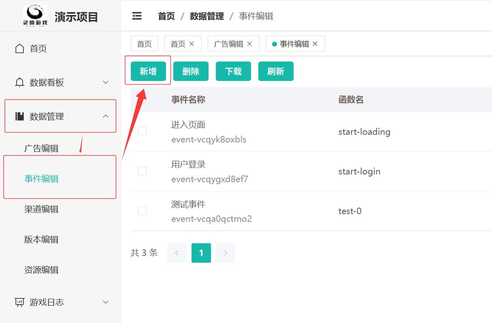
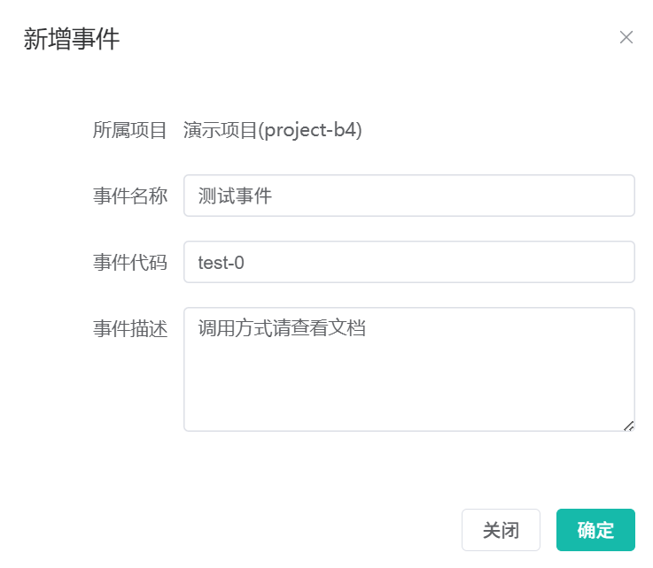
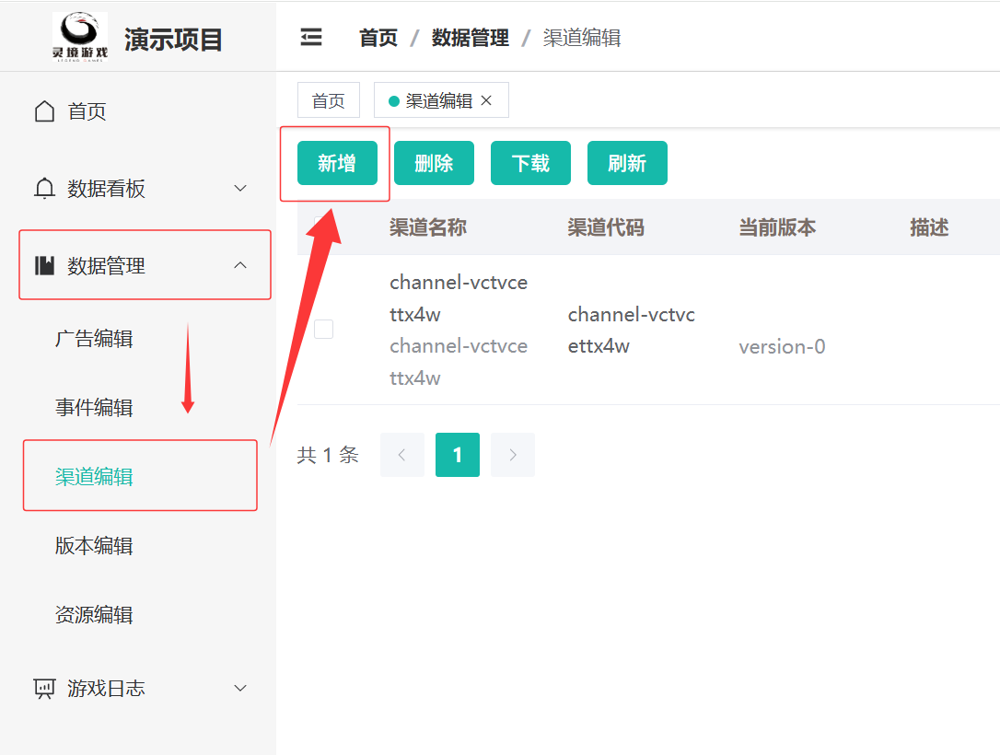

# 数据埋点

Clever SDK 提供了与后端数据分析系统集成的能力。要使用数据埋点功能，你需要：

## 创建埋点

由策划或优化师登录后台, 在事件管理中新建事件。



新建事件需要提供事件名以及事件代码, 事件代码重复将会导致下载映射功能异常.




事件创建完成后会分配一个 id, 该 id 是用于后续各类数据分析的唯一凭证.

## 数据上报

Clever SDK 提供了统一的接口来上报数据埋点事件。

可使用 `reportEvent` 来发送事件。

为了方便记忆, 建议下载事件映射表, 使用事件代码来替代事件 id.

### 示例：上报自定义事件

```ts
(window as any).mySdk.reportEvent("level_start", { // 事件名称
    level_id: "level_1", // 事件参数
    player_id: "user_123",
    difficulty: "easy"
});

(window as any).mySdk.reportEvent("level_complete", {
    level_id: "level_1",
    player_id: "user_123",
    score: 1000,
    time_spent: 120 // 秒
});
```

### 常见事件类型

* **用户行为**: 登录、注册、点击按钮、完成任务等。
* **游戏进程**: 关卡开始、关卡结束、获得道具、使用技能等。
* **经济系统**: 购买商品、消耗货币、获得奖励等。


## 设置平台和渠道

Clever SDK 支持多平台和多渠道的埋点上报。

创建过程和事件列斯



接着由程序在初始化时设置平台和渠道信息。

```ts
import {SdkManager} from "./SdkManager";
const sdkConfig = {
    platform: "android", // 平台
    channel: "google_play", // 渠道
    sdk_url: "YOUR_SDK_SERVER_URL",
    sdk_key: "YOUR_SDK_KEY",
    game_id: "YOUR_GAME_ID"
}
SdkManager.initSdk(sdkConfig);
```

## 3. 数据分析

埋点数据会发送到后端数据分析系统。

接下来演示如何在数据分析平台查看和分析这些数据，包括：

* **用户留存率**: 分析用户在不同时间段的留存情况。
* **付费转化率**: 分析用户从免费玩家到付费玩家的转化情况。
* **关卡漏斗**: 分析用户在游戏关卡中的流失情况。
* **广告效果**: 结合广告监测数据，分析广告对用户行为的影响。
