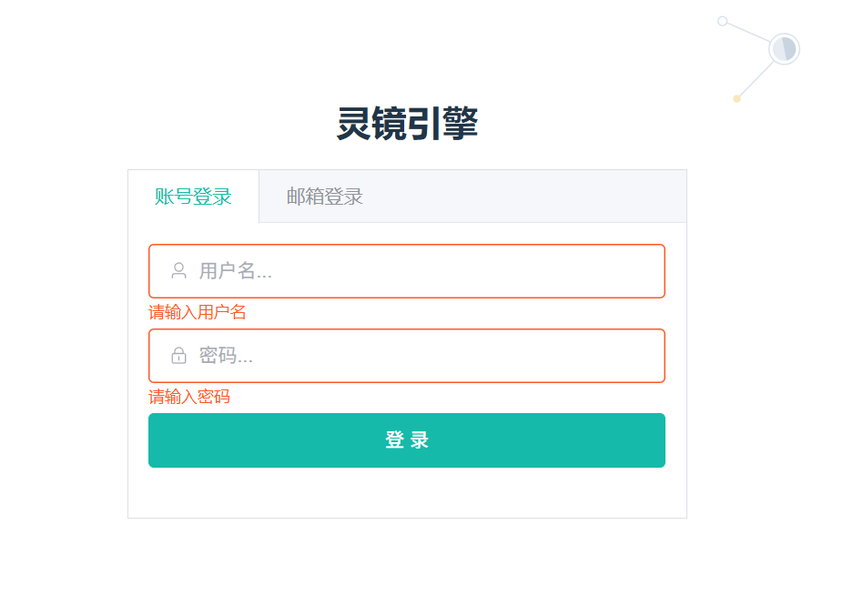

# 用户登录

灵镜引擎提供两种便捷的登录方式：账号登录和邮箱登录。本指南将详细介绍每种登录方式的具体操作步骤。

## 访问登录页面

### 进入登录界面
1. 打开浏览器，访问[灵镜引擎官方网站](https://data.lingame.cn/)
2. 点击页面右上角的"登录"按钮
3. 或者直接访问[登录页面](https://data.lingame.cn/login)

### 登录页面界面说明
- **选项卡切换**：页面顶部有"账号登录"和"邮箱登录"两个选项卡
- **输入区域**：中央为登录信息输入表单
- **操作按钮**：底部为登录和其他相关操作按钮
- **帮助链接**：页面底部通常有"忘记密码"、"注册账号"等链接

## 账号登录

如果您已经设置了用户名和密码，推荐使用账号登录方式。

### 操作步骤

#### 第一步：选择登录方式
1. 在登录页面顶部，点击"账号登录"选项卡
2. 确认当前处于账号登录模式

#### 第二步：输入登录信息
1. **用户名输入**：
   - 在"用户名"输入框中输入您的账号
   - 用户名通常是您注册时设置的唯一标识符
   - 支持字母、数字和部分特殊字符

2. **密码输入**：
   - 在"密码"输入框中输入您的登录密码
   - 密码输入时会显示为圆点或星号以保护隐私
   - 可以点击密码框右侧的"眼睛"图标切换显示/隐藏密码

#### 第三步：完成登录
1. 检查输入的用户名和密码是否正确
2. 如需要，勾选"记住我"选项（可选）
3. 点击"登录"按钮
4. 等待系统验证并跳转到主界面

### 账号登录注意事项
- **大小写敏感**：用户名和密码都区分大小写
- **输入限制**：连续输入错误可能会触发安全限制
- **会话保持**：勾选"记住我"可以在一定时间内保持登录状态

## 邮箱登录

邮箱登录提供了更灵活的验证方式，支持验证码和密码两种验证方法。

### 操作步骤

#### 第一步：选择登录方式
1. 在登录页面顶部，点击"邮箱登录"选项卡
2. 确认当前处于邮箱登录模式

#### 第二步：输入邮箱地址
1. 在"邮箱地址"输入框中输入您的注册邮箱
2. 确保邮箱地址格式正确（包含@符号和有效域名）
3. 系统会自动验证邮箱格式的有效性

#### 第三步：选择验证方式

**方式一：验证码登录（推荐）**

1. **获取验证码**：
   - 点击"获取验证码"按钮
   - 系统会向您的邮箱发送6位数字验证码
   - 按钮会显示倒计时，防止频繁发送

2. **输入验证码**：
   - 检查您的邮箱收件箱（包括垃圾邮件文件夹）
   - 找到来自灵镜引擎的验证码邮件
   - 在"验证码"输入框中输入收到的6位数字
   - 验证码通常在5-10分钟内有效

3. **完成登录**：
   - 确认验证码输入正确
   - 点击"登录"按钮

**方式二：密码登录**

1. **切换到密码模式**：
   - 在邮箱登录界面中找到"使用密码登录"选项
   - 点击切换到密码输入模式

2. **输入密码**：
   - 在"密码"输入框中输入您的账户密码
   - 如果忘记密码，可以点击"忘记密码"链接重置

3. **完成登录**：
   - 检查邮箱和密码是否正确
   - 点击"登录"按钮

## 登录后的操作

### 成功登录后
1. **自动跳转**：系统会自动跳转到主仪表板或上次访问的页面
2. **会话建立**：建立用户会话，保持登录状态
3. **权限加载**：加载用户权限和可访问的项目列表
4. **个人设置**：可以访问个人账户设置和偏好配置

### 登录状态管理
- **会话时长**：登录会话通常会保持一定时间
- **自动登出**：长时间不活动可能会自动登出
- **多设备登录**：支持在多个设备上同时登录
- **安全登出**：使用完毕后建议主动登出

## 登录问题排查

### 常见登录问题

#### 账号登录问题
**Q: 提示"用户名或密码错误"怎么办？**
**A:** 解决步骤：
1. 确认用户名拼写是否正确
2. 检查密码是否正确（注意大小写）
3. 尝试使用邮箱登录方式
4. 如果仍然无法登录，使用"忘记密码"功能重置密码

**Q: 账号被锁定怎么办？**
**A:** 
- 等待锁定时间结束（通常15-30分钟）
- 或联系客服解锁账号
- 避免连续多次输入错误密码

#### 邮箱登录问题
**Q: 收不到验证码邮件怎么办？**
**A:** 检查步骤：
1. 确认邮箱地址输入正确
2. 检查垃圾邮件/垃圾箱文件夹
3. 确认邮箱服务正常
4. 等待2-3分钟后重试
5. 尝试使用其他邮箱地址

**Q: 验证码过期了怎么办？**
**A:** 
- 重新点击"获取验证码"按钮
- 输入新收到的验证码
- 验证码通常5-10分钟内有效

### 技术问题
**Q: 页面加载缓慢或无法访问？**
**A:** 
- 检查网络连接
- 尝试刷新页面
- 清除浏览器缓存
- 尝试使用其他浏览器
- 检查是否有防火墙或代理设置影响

**Q: 登录后立即被登出？**
**A:** 
- 检查浏览器是否启用了Cookie
- 确认系统时间设置正确
- 尝试清除浏览器缓存和Cookie
- 联系技术支持

## 安全建议

### 密码安全
- 使用强密码（包含大小写字母、数字和特殊字符）
- 定期更换密码
- 不要在多个平台使用相同密码
- 不要将密码告诉他人

### 登录安全
- 在公共场所使用后及时登出
- 不要在不信任的设备上保存登录信息
- 定期检查登录记录
- 发现异常登录及时修改密码